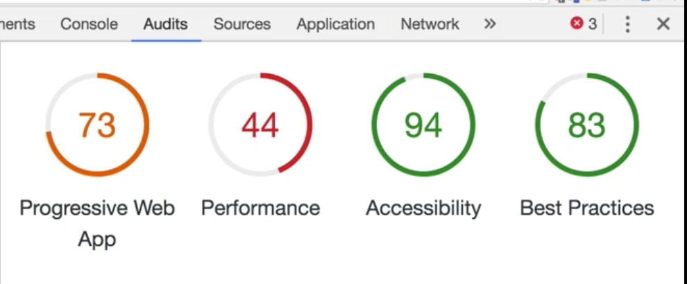

## Progressive Web Apps (PWA) - The Complete Guide

### What are Progressive Web Apps (PWAS)?

In the end progressive web apps is just a term to a couple of features you can
add to any web application to enhance it.

You progressively enhance your existing web pages to feel and work more like native mobile apps.

__Progressive apps should be:__

  - Reliable: Load fast and provide offline functionality (initial load);
  - Fast: Respond quickly to user actions;
  - Engaging: Feel like a native app on mobile devices;

Some examples of native mobile apps behaviors:
- Your app can work if you're offline;
- having an icon on the home screen;
- access the device camera or the location;
- synchronizing data on the background;

__Progressive app example:__

[Financial Times](https://app.ft.com/)

Lighthouse test:

### Core Building Blocks

__Service Workers:__

Supported in modern browsers. Are basically Javascript running in a background process, even if your application is closed.

Allow offline access to cache some files and serve them if we don't have internet connection.

Enable other progressive web app related features (e.g background sync, push notification, etc).

__Application Manifest:__

Makes your application installable on home screens.

__Responsive Design:__

App / Layout should work and look good across Devices.

Geolocation API - user location.

Media API - Access device Camera and Microphone.
